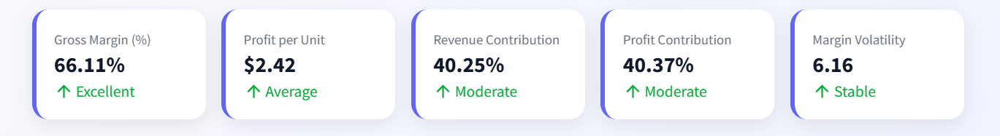
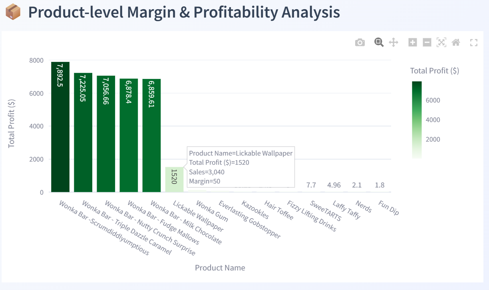
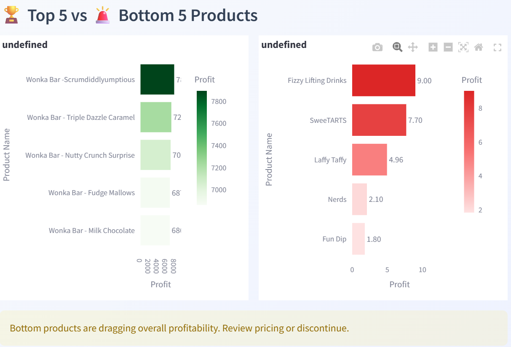
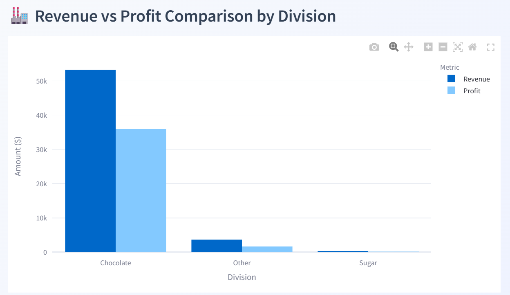
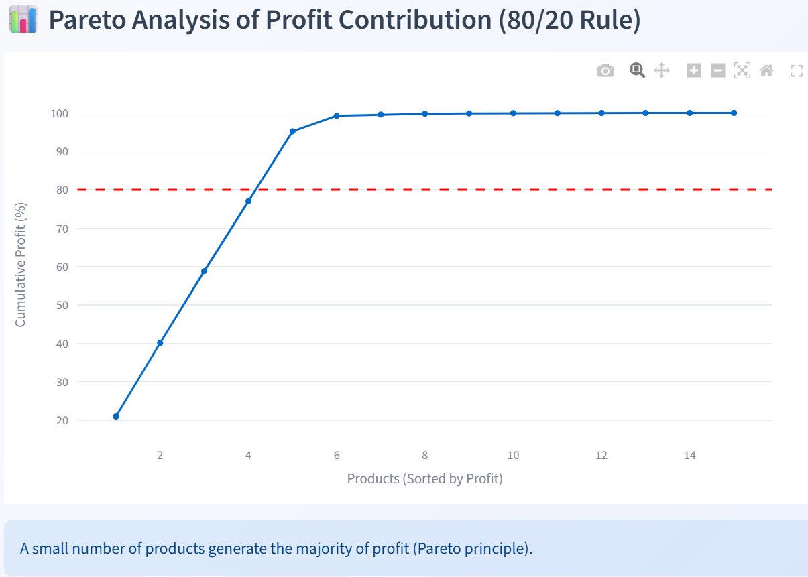
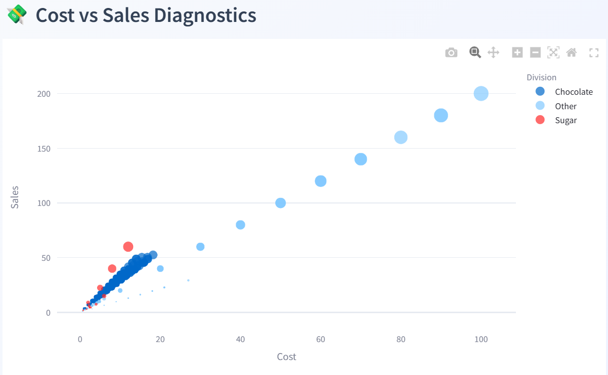
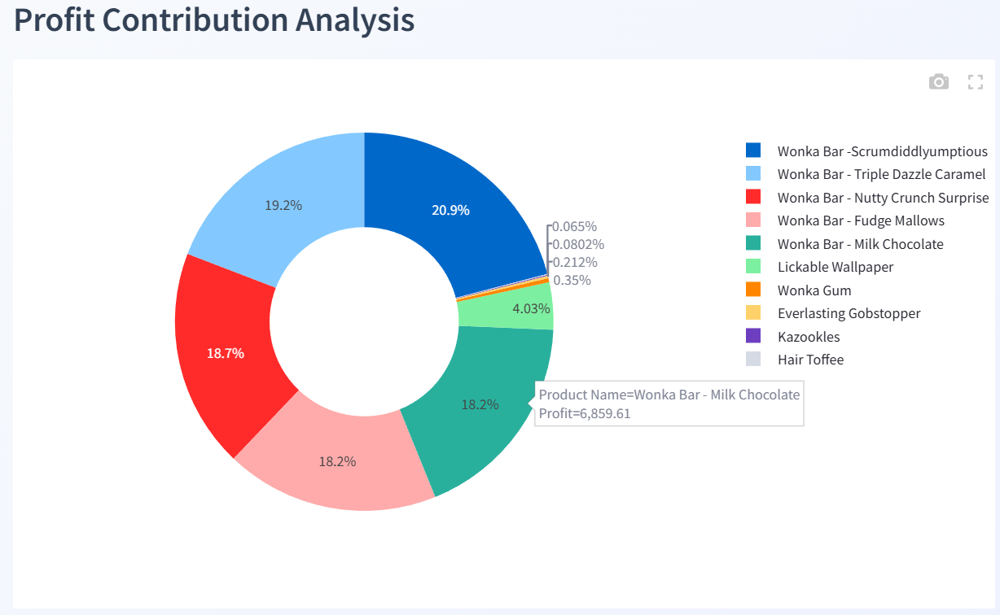
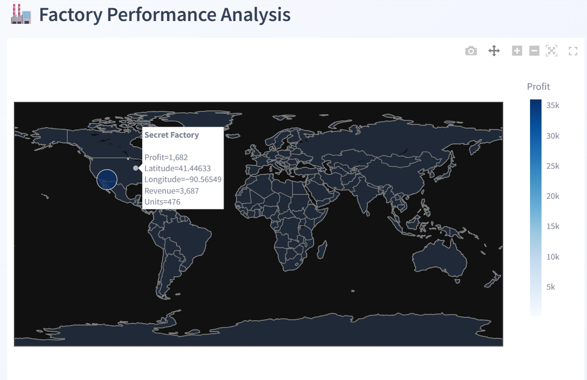

# 🍬 Nassau Candy Profitability Analysis

## 📌 Product Line Profitability & Margin Performance Analysis

---

## 📖 Project Overview

This project focuses on analyzing **product-level profitability and margin performance** for Nassau Candy Distributor using data-driven techniques.

In retail distribution, high sales volume does not always translate into high profit. This project helps identify:

* High-profit and high-margin products
* Low-margin, high-cost products
* Division-wise financial performance
* Profit concentration using Pareto (80/20) analysis

The goal is to enable **data-driven decision-making** for pricing, product strategy, and cost optimization.

---

## 🎯 Objectives

* Analyze product-level profitability
* Evaluate division and regional performance
* Identify margin-risk products
* Perform Pareto analysis
* Provide actionable business insights

---

## 📊 Dataset Description

The dataset contains key business attributes:

* Sales, Cost, Gross Profit, Units
* Product Name and Division
* Region and Order Date
* Customer and shipping details

---

## 🛠️ Tech Stack

* **Python**
* **Pandas & NumPy** – Data processing
* **Plotly** – Interactive visualization
* **Streamlit** – Dashboard development

---

## 📸 Dashboard Preview

### 🔹 KPI Overview



---

### 🔹 Product Profitability Analysis



---

### 🔹 Top vs Bottom Products



---

### 🔹 Division Performance



---

### 🔹 Pareto Analysis (80/20 Rule)



---

### 🔹 Cost vs Sales Diagnostics



---

### 🔹 Profit Contribution Analysis



---

### 🔹 Factory Performance (Advanced Insight)



---

## 📈 Key Features

### 📦 Product Profitability Analysis

* Identify top and bottom performing products
* Profit contribution visualization
* High-profit vs low-margin detection

### 🏭 Division Performance Dashboard

* Revenue vs Profit comparison
* Average margin by division
* Margin distribution analysis

### 💸 Cost & Margin Diagnostics

* Cost vs Sales relationship
* Margin risk detection
* Identification of inefficient products

### 📊 Profit Concentration (Pareto Analysis)

* 80/20 rule visualization
* Key profit drivers identification
* Dependency risk detection

### 📅 Trend Analysis

* Monthly revenue and profit trends
* Margin trends over time

### 🏭 Factory Performance (Advanced Feature)

* Factory-level profit insights
* Geographical performance visualization

---

## 📌 Key Insights

* A small number of products generate the majority of profit (Pareto principle)
* High sales does not guarantee high profitability
* Some products have high cost but low margins
* Chocolate division is the most profitable
* Strong dependency on top-performing products introduces business risk

---

## 💡 Business Recommendations

* Focus on high-margin products for growth
* Reprice or optimize low-margin products
* Improve cost efficiency and sourcing strategies
* Reduce dependency on limited products
* Expand in high-performing regions
* Use forecasting for better demand planning

---
Published a research paper on “Product Profitability & Margin Analysis” on Zenodo

🔗 Research Paper (DOI):
https://doi.org/10.5281/zenodo.19486898

🔗 Live Dashboard:
https://e9envpexvbrayubbmrlbzb.streamlit.app/

🔗 GitHub Repository:
https://github.com/Kdsingh82405/nassau-candy-profit-analysis

---

## 📂 Project Structure

```
📁 nassau-candy-profit-analysis
│── app.py
│── data/
│── assets/
│── README.md
│── docs/
```

---

## ▶️ How to Run Locally

```bash
# Clone repository
git clone https://github.com/Kdsingh82405/nassau-candy-profit-analysis.git

# Navigate to project folder
cd nassau-candy-profit-analysis

# Install dependencies
pip install -r requirements.txt

# Run the app
streamlit run app.py
```

---

## 📄 Research Paper

This project includes a detailed research paper covering:

* Methodology
* KPI analysis
* Product & division insights
* Pareto analysis
* Cost diagnostics
* Strategic recommendations

---

## 📌 Conclusion

This project demonstrates how data analytics can transform raw business data into actionable insights. By focusing on profitability rather than just sales, organizations can improve pricing strategies, optimize product portfolios, and achieve sustainable growth.

---

## ⭐ If you found this project useful

Give it a ⭐ on GitHub!
